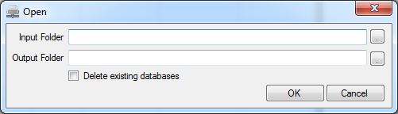
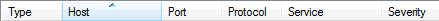
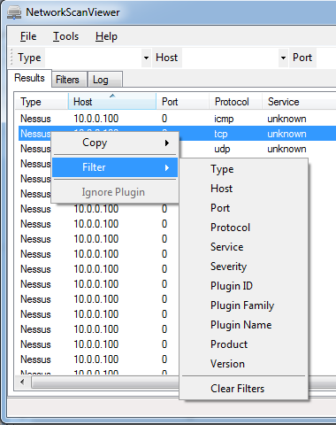
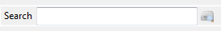
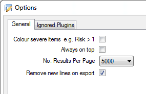
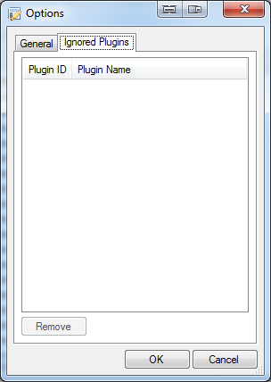

# NetworkScanViewer #

## Introduction ##

NetworkScanViewer is a GUI application designed to help view the results of nessus and nmap  scan results. 

The application loads the scan data from nessus and nmap XML, does some data cleansing, then displays the results on the results list. The list data can be sorted by clicking on the column headers, so it is easy to order and locate particular information. There is also the ability to filter on specific information like host, port, service etc so it is easy to drill down to specific information.

The export functionality exports using the data shown in the results list, so if you change the sort order or filter the results, then it is reflected in the export. It is also possible to permanently exclude scripts that just generate noise by right clicking on the item and selecting "Ignore Plugin" from the context menu. Excluded scripts can be re-added at any time by using the Options window.

**Note**

To check whether the correct version of nessus export files is being used, open up the file in a text editor and look for the following in the file header, if it does not contain it then it is the wrong version:

    <?xml version="1.0" ?>
    <NessusClientData_v2>
    
**Features**

- Data cleansing
- Export to CSV and XML
- Sortable data columns
- Data Filtering
- Script excluding
- Data paging to support large volumes of data
- ESENT database to support large volumes of data

**Requirements**

- Windows x64
- Microsoft .NET Framework v4.5

## Usage ##

**Importing**

To import the nessus and nmap results, perform the following:

- Select the File->Open menu item, the Open window will be displayed
- Either type, copy and paste or use the folder browse dialog to select the top level/root directory that contains the nessus and nmap XML result files (Input Folder)
- Next type, copy and paste or use the folder browse dialog to select the directory where you want the database etc to be stored
- If you want a clear data base with no existing results then ensure that the Delete existing database option is checked. If the option is not used and the same or an overlapping data set is used, then you will end up with duplicate records.
- Click the OK button, the application will then recurse through the directories and attempt to load any files with *.xml or *.nessus file extensions
- As the files are processed, the progress will be output to the Log tab, it will display the file paths of any files that have been successfully parsed or files that have failed to be parsed.

**Sorting**

- To sort the data, simply double click the appropriate column header of the results list

**Filtering**

There are two different ways to perform filtering within NetworkScanViewer:

- Select the drop down list that you want to filter on e.g. Host, Port, Service etc and then choose the appropriate item from the drop down list
- The filter drop down lists can be found both on the toolbar (Type, Host, Port, Service, free text service) and the Filters tab (Protocol, Plugin ID, Plugin Name, Plugin Family, Product, Version)

- Right click on the result line, the result context menu will be displayed
- Select the item you want to filter on by clicking the appropriate sub menu item

To clear the filters either select the Filters->Clear Filters sub menu item on the result list context menu or change each drop down to the first item e.g. blank. Note that "Type" means either Nessus or Nmap result type

**Searching**

NetworkScanViewer has the ability to perform free text searching via the Search textbox. It is possible to take string from the output window located on the right and use it to perform a search. 

**Exporting**

NetworkScanViewer permits the export of result data in either CSV or XML format. The export functionality works on the data currently viewable in the results list, therefore set the appropriate sorting and filters:

- Select the File->Save->Results->CSV or File->Save->Results->XML menu item, a Save File dialog will be displayed
- Choose the output path/file
- Click the Save button, the data will be exported to the chosen file

It is also possible to export the Host Summary information as CSV:
- Select the File->Save->Host Summary->CSV menu item. A Save File dialog will be displayed
- Choose the output path/file
- Click the Save button, the data will be exported to the chosen file

**Ignore Plugins**

Some nessus plugins just create noise, so you can remove them from the results and they will not be shown again, until allowed via the Options window.

- Right click on the results list to display the context menu
- Select the Ignore Plugin menu item, the results will be reloaded

**Options**

The options window allows a number of configuration settings to be set.

- Colour severe items e.g. Risk > 1: This only applies to nessus results
- Always on top: This ensures the application remains the top most window
- No. Results Per Page: This is related to the paging implemented to cope with very large data sets
- Remove new lines on export: This will remove new lines completely, when performing a CSV export

The second tab (Ignored Plugins) allows the user to remove ignored plugins. To remove plugins select the item and click on the Remove button

